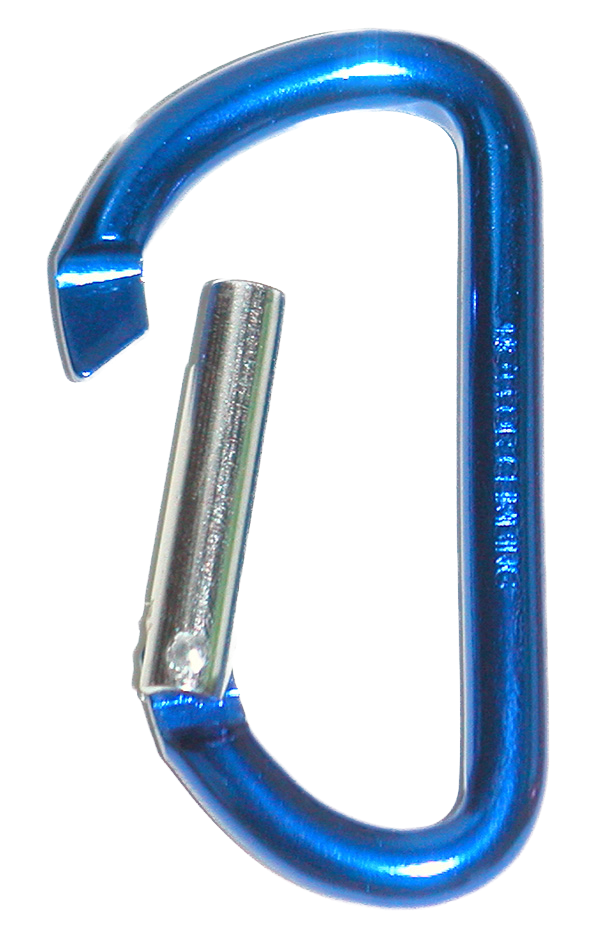

# beat-carabiner-java

A Java library for bridging Pioneer Pro DJ Link networks and
[Ableton Link](https://www.ableton.com/en/link/). A port of the Clojure
[beat-carabiner](https://github.com/Deep-Symmetry/beat-carabiner)
(if you are working in Clojure, use that instead).

## Usage

beat-carabiner-java is available through Maven Central, so to use it in your 
project, all you need is to include the appropriate dependency.

1. Set up a Java project using [Maven](https://maven.apache.org) or a compatible build system.

2. Add this project as a dependency:
   

   Click the **maven central** badge above to view the repository entry
   for beat-carabiner-java. The proper format for including the latest release as a
   dependency in a variety of tools, can be found and copied in the **Snippets**
   section by choosing your build tool from the menu.

See the [API Documentation](http://deepsymmetry.org/beat-carabiner-java/snapshot/apidocs/)
for full details, but here is a nutshell guide:

**To Do: Write this! And update API docs link to a non-snapshot link after first release!**

Although it is possible to download (or build) and start your own copy
of [Carabiner](https://github.com/Deep-Symmetry/carabiner) if you are
working on an operating system or processor architecture that is not
yet supported by
[lib-carabiner](https://github.com/Deep-Symmetry/lib-carabiner), in most
situations you can let beat-carabiner-java automatically manage an embedded
instance for you using lib-carabiner. You will need at least Java 9 to
load beat-carabiner-java, but a current release will perform better and have
more recent security updates.

#### Carabiner Version Warnings

The Clojure version of this library has a mechanism by which warnings of
Carabiner version mismatches can be passed along to whatever user interface
you are providing. This has been omitted from the Java port, mostly because
it has been so long since the older Carabiner versions have been in use that
this is unlikely to ever occur today. If it does happen, a warning will be
logged. If you need this functionality (perhaps if there is a new Carabiner
version released that adds new incompatibilities), please file a pull request
to implement it, or (less happily) an issue to request its implementation.

### Logging Configuration

beat-carabiner-java uses [slf4j](http://www.slf4j.org/manual.html) to allow
you to integrate it with whatever Java logging framework your project
is using, so you will need to include the appropriate slf4j binding on
your class path.

## Getting Help

Deep Symmetry&rsquo;s projects are generously sponsored with hosting
by <a href="https://zulip.com">Zulip</a>, an open-source modern team
chat app designed to keep both live and asynchronous conversations
organized. Thanks to them, you can <a
href="https://deep-symmetry.zulipchat.com/#narrow/stream/278354-carabiner">chat
with our community</a>, ask questions, get inspiration, and share your
own ideas. You can also open an
[issue](https://github.com/Deep-Symmetry/beat-carabiner/issues) on the
project if you have found something that seems to need fixing.

## Research

This project is being developed with the help of
[dysentery](https://github.com/Deep-Symmetry/dysentery). Check that
out for details of the packets and protocol, and for ways you can help
figure out more. You can also view [Snapshot API
Documentation](https://deepsymmetry.org/beat-carabiner-java/snapshot/apidocs/) to
see what is available in the latest preview release.

### Funding

Beat Carabiner Java is, and will remain, completely free and open-source. If it
has helped you, taught you something, or inspired you, please let us
know and share some of your discoveries and how you are using it! If
you'd like to financially support its ongoing development, you are
welcome (but by no means obligated) to donate to offset the hundreds
of hours of research, development, and writing that have already been
invested. Or perhaps to facilitate future efforts, tools, toys, and
time to explore.

 using Liberapay, or
 using PayPal

> If enough people jump on board, we may even be able to get more
> gear to experiment with, although that's an unlikely stretch goal.
> :grinning:

### Contributing in Other Ways

If you have ideas, discoveries, or even code you’d like to share,
that’s fantastic! Please take a look at the
[guidelines](https://github.com/Deep-Symmetry/beat-link/blob/main/CONTRIBUTING.md) and get in touch!

## Licenses

Copyright © 2023 [Deep Symmetry, LLC](http://deepsymmetry.org)

Distributed under the [Eclipse Public License
2.0](https://opensource.org/licenses/EPL-2.0). By using this software
in any fashion, you are agreeing to be bound by the terms of this
license. You must not remove this notice, or any other, from this
software. A copy of the license can be found in
[LICENSE.md](https://github.com/Deep-Symmetry/beat-carabiner/blob/master/LICENSE.md)
within this project.

The included copies of Carabiner are distributed under the [GNU
General Public License, version
2](https://opensource.org/licenses/GPL-2.0). A copy of the license can be found in
[gpl-2.0.md](https://github.com/Deep-Symmetry/beat-carabiner/blob/master/gpl-2.0.md)
within this project.
